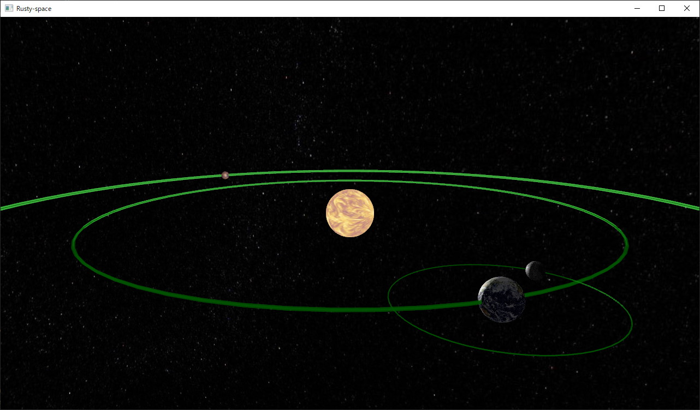

# rusty-space

A space simulator for demonstrating [nom](https://github.com/Geal/nom) crate utilization.

## Overview

This project is a small demonstration of how to use parser combinator to make a simple configuration format in real use case.

This project uses [`three-d`](https://github.com/asny/three-d) crate for 3-d rendering, and
[`nom`](https://github.com/Geal/nom) crate for configuration file parsing.

## How to run

* Be in a Windows or Linux.
* Install [Rust](https://www.rust-lang.org/)
* Run `cargo r`

Note that this project depends on the latest master branch of `three-d` and `three-d-asset` crates for unpublished features.
It may break the compilation at some point in time.

## Parser introduction

[examples](examples) folder contains step-by-step implementation of parser with the help of `nom` crate.
